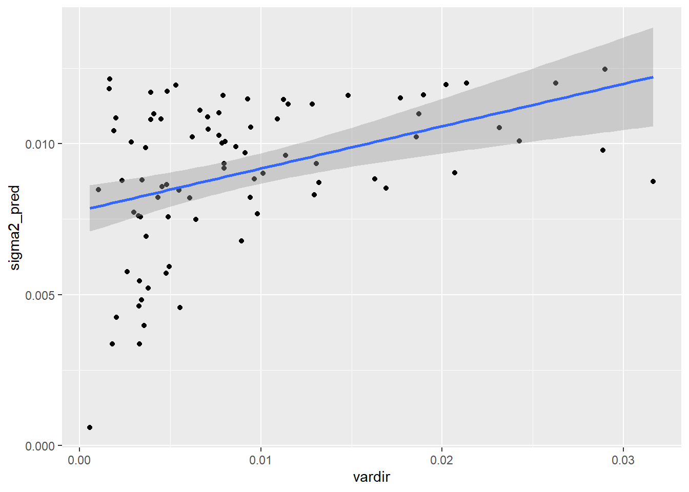
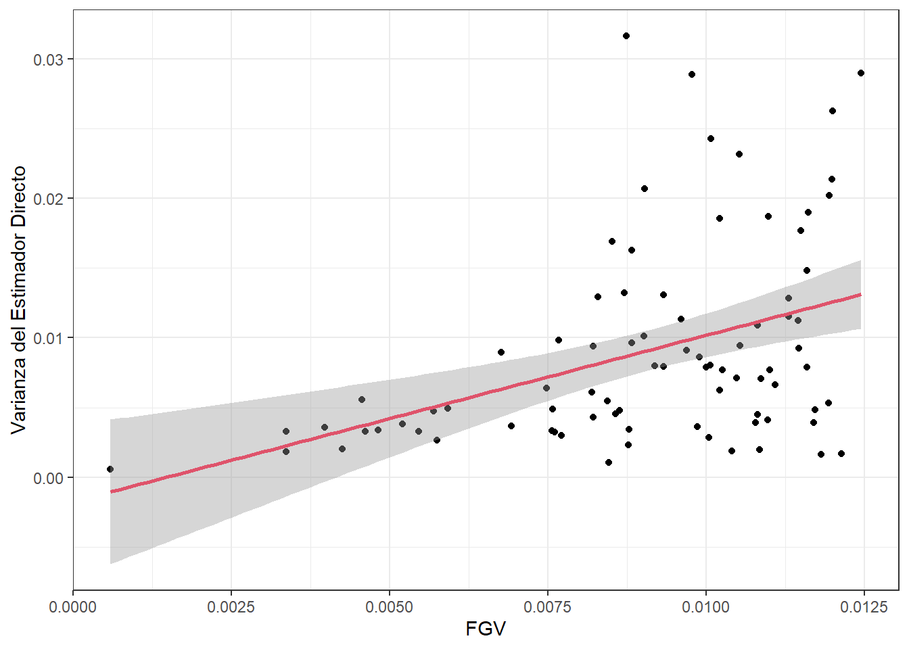

Uno de los insumos más importantes en el modelo de áreas es la 
varianza del estimador directo, a nivel de dominio, la cual no puede calcularse de ningún modo. En correspondencia, este valor debe estimarse desde los datos recolectados en cada dominio. Sin embargo, 
en dominios en las que se cuenta con un tamaño de muestra muy pequeño, estas estimaciones no tendrán un buen comportamiento. Por ende, es muy útil utilizar un modelo de **suavizamiento** de las varianzas para 
eliminar el ruido y la volatilidad de estas estimaciones y extraer la verdadera señal del proceso

Hidiroglou (2019) afirma que $E_{mp}\left(\hat{\theta}^{dir}_d\right)=\boldsymbol{x}_{d}\boldsymbol{\beta}$ y $V_{mp}\left(\hat{\theta}^{dir}_d\right)=\sigma_{u}^2+\tilde{\psi}^2_{d}$, en donde el subíndice  $mp$ hace referencia a la inferencia doble que se debe tener en cuenta en este tipo de ajustes y define la medida de probabilidad conjunta entre el modelo y el diseño de muestreo.  

-   $m$ hace referencia a la medida de probabilidad inducida por el modelamiento y la inclusión de las covariables auxiliares ($\boldsymbol{x}_{d}$).

-   $p$ hacer referencia a la medida de probabilidad inducida por el diseño de muestreo complejo que 
induce las estimaciones directas. 

La solución que acá se plantea se conoce con el nombre de Función Generalizada de Varianza, la cual consiste en ajustar un modelo log-lineal a la varianza directa estimada. Partiendo del hecho de que
se tiene acceso a un estimador insesgado de $\psi^2$, denotado por $\hat{\psi}^2$ se tiene que:
$$
E_{mp}\left(\hat{\psi}_{d}^{2}\right)=E_{m}\left(E_{p}\left(\psi_{d}^{2}\right)\right)=E_{m}\left(\psi_{d}^{2}\right)=\tilde{\psi}_{d}^{2}
$$

La anterior igualdad puede interpretarse como que un estimador insesgado y simple de $\tilde{\psi}_{d}^{2}$ puede ser $\hat{\psi}_{d}^{2}$. Sin embargo, este estimador de muestreo es inestable cuando el tamaño de muestra es pequeño, que es justo el paradigma dominante en la estimación de áreas pequeñas. Rivest and Belmonte (2000) consideran modelos de suavizamiento para la estimación de las varianzas directas definidos de la siguiente manera:

$$
\log\left(\hat{\psi}_{d}^{2}\right)=\boldsymbol{z}_{d}^{t}\boldsymbol{\alpha}+\boldsymbol{\varepsilon}_{d}
$$

En donde $\boldsymbol{z}_{d}$ es un vector de covariables explicativas que son funciones de $\boldsymbol{x}_{d}$, $\boldsymbol{\alpha}$ es un vector de parámetros que deben ser estimados, $\boldsymbol{\varepsilon}_{d}$ son errores aleatorios con media cero y varianza constante, que se asumen idénticamente distribuidos condicionalmente sobre $\boldsymbol{z}_{d}$. Del anterior modelo, la
estimación suavizada de la varianza de muestreo está dada por:
$$
\tilde{\psi}_{d}^{2}=E_{mp}\left(\psi_{d}^{2}\right)=\exp\left(\boldsymbol{z}_{d}^{t}\boldsymbol{\alpha}\right)\times\Delta
$$

En donde, $E_{mp}\left(\varepsilon_{d}\right)=\Delta$. No hay necesidad de especificar una distribución paramétrica para los
errores de este modelo. Al utilizar el método de los momentos, se tiene el siguiente estimador insesgado para $\Delta$: 
$$
\hat{\Delta}=\frac{\sum_{d=1}^{D}\hat{\psi}_{d}^{2}}{\sum_{d=1}^{D}\exp\left(\boldsymbol{z}_{d}^{t}\boldsymbol{\alpha}\right)}
$$

De la misma forma, al utilizar los procedimientos estándar en una regresión lineal, la estimación del coeficiente de parámetros de regresión está dada por la siguiente expresión:

$$
\hat{\boldsymbol{\alpha}}=\left(\sum_{d=1}^{D}\boldsymbol{z}_{d}\boldsymbol{z}_{d}^{t}\right)^{-1}\sum_{d=1}^{D}\boldsymbol{z}_{d}\log\left(\hat{\psi}_{d}^{2}\right)
$$

Por último, el estimador suavizado de la varianza muestral está definido por:

$$
\hat{\tilde{\psi}}_{d}^{2}=\exp\left(\boldsymbol{z}_{d}^{t}\hat{\boldsymbol{\alpha}}\right)\hat{\Delta}
$$

## Datos de la encuesta


::: {.cell hash='0Recursos/3.0FGV/unnamed-chunk-1_078cd4709c210fa8ed8dabbfc534a7f7'}

```{.r .cell-code}
library(tidyverse)
library(magrittr)
source("0Recursos/0Source_FH.R")

encuesta <- readRDS("Data/encuestaGTM14N.rds") %>% 
  transmute(
    dam = str_pad(dam_ee, width = 2, pad = "0"),
    dam2 = str_pad(mupio, width = 3, pad = "0"),
    dam2 = paste0(dam, dam2),
    wkx = `_fep`, 
    upm = `_upm`,
    estrato = paste0(dam,area_ee),
    pobreza = ifelse(ingcorte < lp, 1 , 0))
```
:::


-   *dam*: Corresponde al código asignado a la división administrativa mayor del país.

-   *dam2*: Corresponde al código asignado a la segunda división administrativa del país.

-   *lp* linea de pobreza definidas por CEPAL. 

-   Factor de expansión por persona (*fep*)


::: {.cell hash='0Recursos/3.0FGV/unnamed-chunk-2_fcdea445a3a4d1ba39d31a3cde0c8bef'}
::: {.cell-output-display}
`````{=html}
<table class="table table-striped lightable-classic" style="width: auto !important; margin-left: auto; margin-right: auto; font-family: Arial Narrow; width: auto !important; margin-left: auto; margin-right: auto;">
 <thead>
  <tr>
   <th style="text-align:left;"> dam </th>
   <th style="text-align:left;"> dam2 </th>
   <th style="text-align:right;"> wkx </th>
   <th style="text-align:right;"> upm </th>
   <th style="text-align:left;"> estrato </th>
   <th style="text-align:right;"> pobreza </th>
  </tr>
 </thead>
<tbody>
  <tr>
   <td style="text-align:left;"> 01 </td>
   <td style="text-align:left;"> 01001 </td>
   <td style="text-align:right;"> 525 </td>
   <td style="text-align:right;"> 1 </td>
   <td style="text-align:left;"> 011 </td>
   <td style="text-align:right;"> 0 </td>
  </tr>
  <tr>
   <td style="text-align:left;"> 01 </td>
   <td style="text-align:left;"> 01001 </td>
   <td style="text-align:right;"> 525 </td>
   <td style="text-align:right;"> 1 </td>
   <td style="text-align:left;"> 011 </td>
   <td style="text-align:right;"> 0 </td>
  </tr>
  <tr>
   <td style="text-align:left;"> 01 </td>
   <td style="text-align:left;"> 01001 </td>
   <td style="text-align:right;"> 525 </td>
   <td style="text-align:right;"> 1 </td>
   <td style="text-align:left;"> 011 </td>
   <td style="text-align:right;"> 0 </td>
  </tr>
  <tr>
   <td style="text-align:left;"> 01 </td>
   <td style="text-align:left;"> 01001 </td>
   <td style="text-align:right;"> 525 </td>
   <td style="text-align:right;"> 1 </td>
   <td style="text-align:left;"> 011 </td>
   <td style="text-align:right;"> 0 </td>
  </tr>
  <tr>
   <td style="text-align:left;"> 01 </td>
   <td style="text-align:left;"> 01001 </td>
   <td style="text-align:right;"> 525 </td>
   <td style="text-align:right;"> 1 </td>
   <td style="text-align:left;"> 011 </td>
   <td style="text-align:right;"> 0 </td>
  </tr>
  <tr>
   <td style="text-align:left;"> 01 </td>
   <td style="text-align:left;"> 01001 </td>
   <td style="text-align:right;"> 525 </td>
   <td style="text-align:right;"> 1 </td>
   <td style="text-align:left;"> 011 </td>
   <td style="text-align:right;"> 0 </td>
  </tr>
  <tr>
   <td style="text-align:left;"> 01 </td>
   <td style="text-align:left;"> 01001 </td>
   <td style="text-align:right;"> 525 </td>
   <td style="text-align:right;"> 1 </td>
   <td style="text-align:left;"> 011 </td>
   <td style="text-align:right;"> 0 </td>
  </tr>
  <tr>
   <td style="text-align:left;"> 01 </td>
   <td style="text-align:left;"> 01001 </td>
   <td style="text-align:right;"> 525 </td>
   <td style="text-align:right;"> 1 </td>
   <td style="text-align:left;"> 011 </td>
   <td style="text-align:right;"> 0 </td>
  </tr>
  <tr>
   <td style="text-align:left;"> 01 </td>
   <td style="text-align:left;"> 01001 </td>
   <td style="text-align:right;"> 525 </td>
   <td style="text-align:right;"> 1 </td>
   <td style="text-align:left;"> 011 </td>
   <td style="text-align:right;"> 0 </td>
  </tr>
  <tr>
   <td style="text-align:left;"> 01 </td>
   <td style="text-align:left;"> 01001 </td>
   <td style="text-align:right;"> 525 </td>
   <td style="text-align:right;"> 1 </td>
   <td style="text-align:left;"> 011 </td>
   <td style="text-align:right;"> 0 </td>
  </tr>
</tbody>
</table>

`````
:::
:::


Definir el diseño muestral haciendo uso de las librerías `srvyr` y `survey`


::: {.cell hash='0Recursos/3.0FGV/unnamed-chunk-3_e863f38e74cbf00e77ac45c92462a6f1'}

```{.r .cell-code}
library(survey)
library(srvyr)
options(survey.lonely.psu = "adjust")

diseno <-
  as_survey_design(
    ids = upm,
    weights = wkx,
    strata = estrato,
    nest = TRUE,
    .data = encuesta
  )
summary(diseno)
```

::: {.cell-output .cell-output-stdout}
```
Stratified 1 - level Cluster Sampling design (with replacement)
With (993) clusters.
Called via srvyr
Probabilities:
    Min.  1st Qu.   Median     Mean  3rd Qu.     Max. 
0.000417 0.003135 0.004975 0.006293 0.007812 0.076923 
Stratum Sizes: 
            011 012 021  022  031 032  041  042  051  052 061  062 071  072 081
obs        1886 259 740 1257 3209 564 1223 1327 1460 1684 653 1072 995 1316 792
design.PSU   42   5  17   26   64  11   26   24   33   34  13   23  20   20  15
actual.PSU   42   5  17   26   64  11   26   24   33   34  13   23  20   20  15
            082  091  092  101  102 111  112 121  122 131  132 141  142 151
obs        1567 1763 1566 1216 1835 776 1202 397 1794 530 1954 484 2031 573
design.PSU   25   37   27   23   31  14   22   9   31   9   31  10   30  10
actual.PSU   25   37   27   23   31  14   22   9   31   9   31  10   30  10
            152 161  162 171  172 181  182 191  192 201  202 211  212 221  222
obs        1130 464 1782 925 1832 471 1218 569 1003 371 1434 750 1556 825 2220
design.PSU   22   8   27  18   32  11   24  14   19   9   24  17   26  18   42
actual.PSU   22   8   27  18   32  11   24  14   19   9   24  17   26  18   42
Data variables:
[1] "dam"     "dam2"    "wkx"     "upm"     "estrato" "pobreza"
```
:::
:::


Para la estimación directa de la proporción se emplea la función `direct.supr`, disponible en el archivo `0Source_FH.R`, dando como resultado.


::: {.cell hash='0Recursos/3.0FGV/unnamed-chunk-4_4163fb04e48cddd89a9f3baf552dfa45'}

```{.r .cell-code}
directodam2 <- direct.supr(design.base = diseno,
                             variable = pobreza, 
                             group = dam2,
                             upm = upm,
                             estrato = estrato)

## 01006 ninguno es pobre.

directodam2 %>%
  group_by(Flag) %>%
  summarise(n = n()) %>% 
  arrange(n) %>% tba()
```

::: {.cell-output-display}
`````{=html}
<table class="table table-striped lightable-classic" style="width: auto !important; margin-left: auto; margin-right: auto; font-family: Arial Narrow; width: auto !important; margin-left: auto; margin-right: auto;">
 <thead>
  <tr>
   <th style="text-align:left;"> Flag </th>
   <th style="text-align:right;"> n </th>
  </tr>
 </thead>
<tbody>
  <tr>
   <td style="text-align:left;"> NA </td>
   <td style="text-align:right;"> 1 </td>
  </tr>
  <tr>
   <td style="text-align:left;"> Incluir </td>
   <td style="text-align:right;"> 83 </td>
  </tr>
  <tr>
   <td style="text-align:left;"> Excluir </td>
   <td style="text-align:right;"> 208 </td>
  </tr>
</tbody>
</table>

`````
:::
:::

En el caso particular de la dam2 **01006** tenemos que: 


::: {.cell hash='0Recursos/3.0FGV/unnamed-chunk-5_ad685d3d67479db634bb6f4df96ecbb0'}

```{.r .cell-code}
temp <-  encuesta %>% filter(dam2 == "01006")
temp %>% group_by(upm)  %>%
  summarise(n = n(),
            pobres = sum(pobreza)) %>% tba()
```

::: {.cell-output-display}
`````{=html}
<table class="table table-striped lightable-classic" style="width: auto !important; margin-left: auto; margin-right: auto; font-family: Arial Narrow; width: auto !important; margin-left: auto; margin-right: auto;">
 <thead>
  <tr>
   <th style="text-align:right;"> upm </th>
   <th style="text-align:right;"> n </th>
   <th style="text-align:right;"> pobres </th>
  </tr>
 </thead>
<tbody>
  <tr>
   <td style="text-align:right;"> 9 </td>
   <td style="text-align:right;"> 53 </td>
   <td style="text-align:right;"> 0 </td>
  </tr>
  <tr>
   <td style="text-align:right;"> 10 </td>
   <td style="text-align:right;"> 40 </td>
   <td style="text-align:right;"> 0 </td>
  </tr>
  <tr>
   <td style="text-align:right;"> 11 </td>
   <td style="text-align:right;"> 50 </td>
   <td style="text-align:right;"> 0 </td>
  </tr>
  <tr>
   <td style="text-align:right;"> 12 </td>
   <td style="text-align:right;"> 42 </td>
   <td style="text-align:right;"> 0 </td>
  </tr>
</tbody>
</table>

`````
:::
:::


Para los dominios que no son excluidos se hace la transformación arcoseno, calculo del *DEFF* y varianza 


::: {.cell hash='0Recursos/3.0FGV/unnamed-chunk-6_b942d3b912d32ec6f7aa9637f187a4eb'}

```{.r .cell-code}
base_sae <- directodam2 %>% 
  filter(Flag != "Excluir") %>%
  transmute(
    dam2 = dam2,             # Id para los dominios
    nd = n,                    # Número de observaciones por dominios
    n_effec = n.eff,           # n efectivo. 
    pobreza = p,               # Estimación de la variable
    pobreza_T = asin(sqrt(pobreza)), # Transformación arcoseno 
    vardir = ee ^ 2,                 # Estimación de la varianza directa 
    cv = CV,                       
    var_zd = 1 / (4 * n_effec),      # Varianza para la tranformación arcsin
    deff_dam2 = deff                # Deff por dominio
  )

# View(base_sae)
tba(head(base_sae))
```

::: {.cell-output-display}
`````{=html}
<table class="table table-striped lightable-classic" style="width: auto !important; margin-left: auto; margin-right: auto; font-family: Arial Narrow; width: auto !important; margin-left: auto; margin-right: auto;">
 <thead>
  <tr>
   <th style="text-align:left;"> dam2 </th>
   <th style="text-align:right;"> nd </th>
   <th style="text-align:right;"> n_effec </th>
   <th style="text-align:right;"> pobreza </th>
   <th style="text-align:right;"> pobreza_T </th>
   <th style="text-align:right;"> vardir </th>
   <th style="text-align:right;"> cv </th>
   <th style="text-align:right;"> var_zd </th>
   <th style="text-align:right;"> deff_dam2 </th>
  </tr>
 </thead>
<tbody>
  <tr>
   <td style="text-align:left;"> 01007 </td>
   <td style="text-align:right;"> 186 </td>
   <td style="text-align:right;"> 7.7474 </td>
   <td style="text-align:right;"> 0.2996 </td>
   <td style="text-align:right;"> 0.5792 </td>
   <td style="text-align:right;"> 0.0131 </td>
   <td style="text-align:right;"> 38.1556 </td>
   <td style="text-align:right;"> 0.0323 </td>
   <td style="text-align:right;"> 24.0080 </td>
  </tr>
  <tr>
   <td style="text-align:left;"> 02001 </td>
   <td style="text-align:right;"> 400 </td>
   <td style="text-align:right;"> 80.4007 </td>
   <td style="text-align:right;"> 0.4211 </td>
   <td style="text-align:right;"> 0.7062 </td>
   <td style="text-align:right;"> 0.0094 </td>
   <td style="text-align:right;"> 23.0771 </td>
   <td style="text-align:right;"> 0.0031 </td>
   <td style="text-align:right;"> 4.9751 </td>
  </tr>
  <tr>
   <td style="text-align:left;"> 02002 </td>
   <td style="text-align:right;"> 192 </td>
   <td style="text-align:right;"> 16.9086 </td>
   <td style="text-align:right;"> 0.4476 </td>
   <td style="text-align:right;"> 0.7329 </td>
   <td style="text-align:right;"> 0.0290 </td>
   <td style="text-align:right;"> 38.0314 </td>
   <td style="text-align:right;"> 0.0148 </td>
   <td style="text-align:right;"> 11.3552 </td>
  </tr>
  <tr>
   <td style="text-align:left;"> 02003 </td>
   <td style="text-align:right;"> 260 </td>
   <td style="text-align:right;"> 240.4564 </td>
   <td style="text-align:right;"> 0.5179 </td>
   <td style="text-align:right;"> 0.8033 </td>
   <td style="text-align:right;"> 0.0039 </td>
   <td style="text-align:right;"> 12.1013 </td>
   <td style="text-align:right;"> 0.0010 </td>
   <td style="text-align:right;"> 1.0813 </td>
  </tr>
  <tr>
   <td style="text-align:left;"> 02006 </td>
   <td style="text-align:right;"> 190 </td>
   <td style="text-align:right;"> 48.4920 </td>
   <td style="text-align:right;"> 0.5351 </td>
   <td style="text-align:right;"> 0.8205 </td>
   <td style="text-align:right;"> 0.0202 </td>
   <td style="text-align:right;"> 26.5792 </td>
   <td style="text-align:right;"> 0.0052 </td>
   <td style="text-align:right;"> 3.9182 </td>
  </tr>
  <tr>
   <td style="text-align:left;"> 02007 </td>
   <td style="text-align:right;"> 487 </td>
   <td style="text-align:right;"> 83.8274 </td>
   <td style="text-align:right;"> 0.4423 </td>
   <td style="text-align:right;"> 0.7276 </td>
   <td style="text-align:right;"> 0.0091 </td>
   <td style="text-align:right;"> 21.5841 </td>
   <td style="text-align:right;"> 0.0030 </td>
   <td style="text-align:right;"> 5.8096 </td>
  </tr>
</tbody>
</table>

`````
:::
:::


Seleccionando las variables de interés para la FGV. 


::: {.cell hash='0Recursos/3.0FGV/unnamed-chunk-7_ed23b68e95a95a4713778e5817b1a1c1'}

```{.r .cell-code}
baseFGV <-  base_sae %>% 
  select(dam2, pobreza, nd, vardir) %>%
  mutate(ln_sigma2 = log(vardir))
```
:::


# Análisis gráfico


::: {.cell hash='0Recursos/3.0FGV/unnamed-chunk-8_cb4eca16b00526d282b8907864c92767'}

```{.r .cell-code}
theme_set(theme_bw())

# pobreza vs Ln_sigma2 #

p1 <- ggplot(baseFGV, aes(x = pobreza, y = ln_sigma2)) +
  geom_point() +
  geom_smooth(method = "loess") +
  xlab("pobreza")

# Tamaño de muestra vs Ln_sigma2 #

p2 <- ggplot(baseFGV, aes(x = nd, y = ln_sigma2)) + 
  geom_point() +
  geom_smooth(method = "loess") + 
  xlab("Tamaño de muestra")

# Número de pobres vs Ln_sigma2 #

p3 <- ggplot(baseFGV, 
             aes(x = pobreza * nd, y = ln_sigma2)) + 
  geom_point() +
  geom_smooth(method = "loess") + 
  xlab("Número de pobres")

# Raiz_pobreza vs Ln_sigma2 #

p4 <- ggplot(baseFGV, 
             aes(x = sqrt(pobreza), y = ln_sigma2)) + 
  geom_point() +
  geom_smooth(method = "loess") + 
  xlab("Raiz cuadrada de pobreza")

library(patchwork)
(p1 | p2) / (p3 | p4)
```

::: {.cell-output-display}
{width=672}
:::
:::


# Modelo para la varianza


::: {.cell hash='0Recursos/3.0FGV/unnamed-chunk-9_170f91b751c7b201d0a095b2f74ed3c6'}

```{.r .cell-code}
library(gtsummary)
FGV1 <- lm(ln_sigma2 ~ pobreza + I(nd^2) + I(sqrt(pobreza)),
     data = baseFGV)

tbl_regression(FGV1) %>% 
  add_glance_table(include = c(r.squared, adj.r.squared))
```

::: {.cell-output-display}
```{=html}
<div id="ztinnafigi" style="padding-left:0px;padding-right:0px;padding-top:10px;padding-bottom:10px;overflow-x:auto;overflow-y:auto;width:auto;height:auto;">
<style>html {
  font-family: -apple-system, BlinkMacSystemFont, 'Segoe UI', Roboto, Oxygen, Ubuntu, Cantarell, 'Helvetica Neue', 'Fira Sans', 'Droid Sans', Arial, sans-serif;
}

#ztinnafigi .gt_table {
  display: table;
  border-collapse: collapse;
  margin-left: auto;
  margin-right: auto;
  color: #333333;
  font-size: 16px;
  font-weight: normal;
  font-style: normal;
  background-color: #FFFFFF;
  width: auto;
  border-top-style: solid;
  border-top-width: 2px;
  border-top-color: #A8A8A8;
  border-right-style: none;
  border-right-width: 2px;
  border-right-color: #D3D3D3;
  border-bottom-style: solid;
  border-bottom-width: 2px;
  border-bottom-color: #A8A8A8;
  border-left-style: none;
  border-left-width: 2px;
  border-left-color: #D3D3D3;
}

#ztinnafigi .gt_heading {
  background-color: #FFFFFF;
  text-align: center;
  border-bottom-color: #FFFFFF;
  border-left-style: none;
  border-left-width: 1px;
  border-left-color: #D3D3D3;
  border-right-style: none;
  border-right-width: 1px;
  border-right-color: #D3D3D3;
}

#ztinnafigi .gt_caption {
  padding-top: 4px;
  padding-bottom: 4px;
}

#ztinnafigi .gt_title {
  color: #333333;
  font-size: 125%;
  font-weight: initial;
  padding-top: 4px;
  padding-bottom: 4px;
  padding-left: 5px;
  padding-right: 5px;
  border-bottom-color: #FFFFFF;
  border-bottom-width: 0;
}

#ztinnafigi .gt_subtitle {
  color: #333333;
  font-size: 85%;
  font-weight: initial;
  padding-top: 0;
  padding-bottom: 6px;
  padding-left: 5px;
  padding-right: 5px;
  border-top-color: #FFFFFF;
  border-top-width: 0;
}

#ztinnafigi .gt_bottom_border {
  border-bottom-style: solid;
  border-bottom-width: 2px;
  border-bottom-color: #D3D3D3;
}

#ztinnafigi .gt_col_headings {
  border-top-style: solid;
  border-top-width: 2px;
  border-top-color: #D3D3D3;
  border-bottom-style: solid;
  border-bottom-width: 2px;
  border-bottom-color: #D3D3D3;
  border-left-style: none;
  border-left-width: 1px;
  border-left-color: #D3D3D3;
  border-right-style: none;
  border-right-width: 1px;
  border-right-color: #D3D3D3;
}

#ztinnafigi .gt_col_heading {
  color: #333333;
  background-color: #FFFFFF;
  font-size: 100%;
  font-weight: normal;
  text-transform: inherit;
  border-left-style: none;
  border-left-width: 1px;
  border-left-color: #D3D3D3;
  border-right-style: none;
  border-right-width: 1px;
  border-right-color: #D3D3D3;
  vertical-align: bottom;
  padding-top: 5px;
  padding-bottom: 6px;
  padding-left: 5px;
  padding-right: 5px;
  overflow-x: hidden;
}

#ztinnafigi .gt_column_spanner_outer {
  color: #333333;
  background-color: #FFFFFF;
  font-size: 100%;
  font-weight: normal;
  text-transform: inherit;
  padding-top: 0;
  padding-bottom: 0;
  padding-left: 4px;
  padding-right: 4px;
}

#ztinnafigi .gt_column_spanner_outer:first-child {
  padding-left: 0;
}

#ztinnafigi .gt_column_spanner_outer:last-child {
  padding-right: 0;
}

#ztinnafigi .gt_column_spanner {
  border-bottom-style: solid;
  border-bottom-width: 2px;
  border-bottom-color: #D3D3D3;
  vertical-align: bottom;
  padding-top: 5px;
  padding-bottom: 5px;
  overflow-x: hidden;
  display: inline-block;
  width: 100%;
}

#ztinnafigi .gt_group_heading {
  padding-top: 8px;
  padding-bottom: 8px;
  padding-left: 5px;
  padding-right: 5px;
  color: #333333;
  background-color: #FFFFFF;
  font-size: 100%;
  font-weight: initial;
  text-transform: inherit;
  border-top-style: solid;
  border-top-width: 2px;
  border-top-color: #D3D3D3;
  border-bottom-style: solid;
  border-bottom-width: 2px;
  border-bottom-color: #D3D3D3;
  border-left-style: none;
  border-left-width: 1px;
  border-left-color: #D3D3D3;
  border-right-style: none;
  border-right-width: 1px;
  border-right-color: #D3D3D3;
  vertical-align: middle;
  text-align: left;
}

#ztinnafigi .gt_empty_group_heading {
  padding: 0.5px;
  color: #333333;
  background-color: #FFFFFF;
  font-size: 100%;
  font-weight: initial;
  border-top-style: solid;
  border-top-width: 2px;
  border-top-color: #D3D3D3;
  border-bottom-style: solid;
  border-bottom-width: 2px;
  border-bottom-color: #D3D3D3;
  vertical-align: middle;
}

#ztinnafigi .gt_from_md > :first-child {
  margin-top: 0;
}

#ztinnafigi .gt_from_md > :last-child {
  margin-bottom: 0;
}

#ztinnafigi .gt_row {
  padding-top: 8px;
  padding-bottom: 8px;
  padding-left: 5px;
  padding-right: 5px;
  margin: 10px;
  border-top-style: solid;
  border-top-width: 1px;
  border-top-color: #D3D3D3;
  border-left-style: none;
  border-left-width: 1px;
  border-left-color: #D3D3D3;
  border-right-style: none;
  border-right-width: 1px;
  border-right-color: #D3D3D3;
  vertical-align: middle;
  overflow-x: hidden;
}

#ztinnafigi .gt_stub {
  color: #333333;
  background-color: #FFFFFF;
  font-size: 100%;
  font-weight: initial;
  text-transform: inherit;
  border-right-style: solid;
  border-right-width: 2px;
  border-right-color: #D3D3D3;
  padding-left: 5px;
  padding-right: 5px;
}

#ztinnafigi .gt_stub_row_group {
  color: #333333;
  background-color: #FFFFFF;
  font-size: 100%;
  font-weight: initial;
  text-transform: inherit;
  border-right-style: solid;
  border-right-width: 2px;
  border-right-color: #D3D3D3;
  padding-left: 5px;
  padding-right: 5px;
  vertical-align: top;
}

#ztinnafigi .gt_row_group_first td {
  border-top-width: 2px;
}

#ztinnafigi .gt_summary_row {
  color: #333333;
  background-color: #FFFFFF;
  text-transform: inherit;
  padding-top: 8px;
  padding-bottom: 8px;
  padding-left: 5px;
  padding-right: 5px;
}

#ztinnafigi .gt_first_summary_row {
  border-top-style: solid;
  border-top-color: #D3D3D3;
}

#ztinnafigi .gt_first_summary_row.thick {
  border-top-width: 2px;
}

#ztinnafigi .gt_last_summary_row {
  padding-top: 8px;
  padding-bottom: 8px;
  padding-left: 5px;
  padding-right: 5px;
  border-bottom-style: solid;
  border-bottom-width: 2px;
  border-bottom-color: #D3D3D3;
}

#ztinnafigi .gt_grand_summary_row {
  color: #333333;
  background-color: #FFFFFF;
  text-transform: inherit;
  padding-top: 8px;
  padding-bottom: 8px;
  padding-left: 5px;
  padding-right: 5px;
}

#ztinnafigi .gt_first_grand_summary_row {
  padding-top: 8px;
  padding-bottom: 8px;
  padding-left: 5px;
  padding-right: 5px;
  border-top-style: double;
  border-top-width: 6px;
  border-top-color: #D3D3D3;
}

#ztinnafigi .gt_striped {
  background-color: rgba(128, 128, 128, 0.05);
}

#ztinnafigi .gt_table_body {
  border-top-style: solid;
  border-top-width: 2px;
  border-top-color: #D3D3D3;
  border-bottom-style: solid;
  border-bottom-width: 2px;
  border-bottom-color: #D3D3D3;
}

#ztinnafigi .gt_footnotes {
  color: #333333;
  background-color: #FFFFFF;
  border-bottom-style: none;
  border-bottom-width: 2px;
  border-bottom-color: #D3D3D3;
  border-left-style: none;
  border-left-width: 2px;
  border-left-color: #D3D3D3;
  border-right-style: none;
  border-right-width: 2px;
  border-right-color: #D3D3D3;
}

#ztinnafigi .gt_footnote {
  margin: 0px;
  font-size: 90%;
  padding-left: 4px;
  padding-right: 4px;
  padding-left: 5px;
  padding-right: 5px;
}

#ztinnafigi .gt_sourcenotes {
  color: #333333;
  background-color: #FFFFFF;
  border-bottom-style: none;
  border-bottom-width: 2px;
  border-bottom-color: #D3D3D3;
  border-left-style: none;
  border-left-width: 2px;
  border-left-color: #D3D3D3;
  border-right-style: none;
  border-right-width: 2px;
  border-right-color: #D3D3D3;
}

#ztinnafigi .gt_sourcenote {
  font-size: 90%;
  padding-top: 4px;
  padding-bottom: 4px;
  padding-left: 5px;
  padding-right: 5px;
}

#ztinnafigi .gt_left {
  text-align: left;
}

#ztinnafigi .gt_center {
  text-align: center;
}

#ztinnafigi .gt_right {
  text-align: right;
  font-variant-numeric: tabular-nums;
}

#ztinnafigi .gt_font_normal {
  font-weight: normal;
}

#ztinnafigi .gt_font_bold {
  font-weight: bold;
}

#ztinnafigi .gt_font_italic {
  font-style: italic;
}

#ztinnafigi .gt_super {
  font-size: 65%;
}

#ztinnafigi .gt_footnote_marks {
  font-style: italic;
  font-weight: normal;
  font-size: 75%;
  vertical-align: 0.4em;
}

#ztinnafigi .gt_asterisk {
  font-size: 100%;
  vertical-align: 0;
}

#ztinnafigi .gt_indent_1 {
  text-indent: 5px;
}

#ztinnafigi .gt_indent_2 {
  text-indent: 10px;
}

#ztinnafigi .gt_indent_3 {
  text-indent: 15px;
}

#ztinnafigi .gt_indent_4 {
  text-indent: 20px;
}

#ztinnafigi .gt_indent_5 {
  text-indent: 25px;
}
</style>
<table class="gt_table">
  
  <thead class="gt_col_headings">
    <tr>
      <th class="gt_col_heading gt_columns_bottom_border gt_left" rowspan="1" colspan="1" scope="col" id="&lt;strong&gt;Characteristic&lt;/strong&gt;"><strong>Characteristic</strong></th>
      <th class="gt_col_heading gt_columns_bottom_border gt_center" rowspan="1" colspan="1" scope="col" id="&lt;strong&gt;Beta&lt;/strong&gt;"><strong>Beta</strong></th>
      <th class="gt_col_heading gt_columns_bottom_border gt_center" rowspan="1" colspan="1" scope="col" id="&lt;strong&gt;95% CI&lt;/strong&gt;&lt;sup class=&quot;gt_footnote_marks&quot;&gt;1&lt;/sup&gt;"><strong>95% CI</strong><sup class="gt_footnote_marks">1</sup></th>
      <th class="gt_col_heading gt_columns_bottom_border gt_center" rowspan="1" colspan="1" scope="col" id="&lt;strong&gt;p-value&lt;/strong&gt;"><strong>p-value</strong></th>
    </tr>
  </thead>
  <tbody class="gt_table_body">
    <tr><td headers="label" class="gt_row gt_left">pobreza</td>
<td headers="estimate" class="gt_row gt_center">-17</td>
<td headers="ci" class="gt_row gt_center">-24, -9.8</td>
<td headers="p.value" class="gt_row gt_center"><0.001</td></tr>
    <tr><td headers="label" class="gt_row gt_left">I(nd^2)</td>
<td headers="estimate" class="gt_row gt_center">0.00</td>
<td headers="ci" class="gt_row gt_center">0.00, 0.00</td>
<td headers="p.value" class="gt_row gt_center">0.016</td></tr>
    <tr><td headers="label" class="gt_row gt_left">I(sqrt(pobreza))</td>
<td headers="estimate" class="gt_row gt_center">23</td>
<td headers="ci" class="gt_row gt_center">13, 32</td>
<td headers="p.value" class="gt_row gt_center"><0.001</td></tr>
    <tr><td headers="label" class="gt_row gt_left" style="border-top-width: 2px; border-top-style: solid; border-top-color: #D3D3D3;">R²</td>
<td headers="estimate" class="gt_row gt_center" style="border-top-width: 2px; border-top-style: solid; border-top-color: #D3D3D3;">0.266</td>
<td headers="ci" class="gt_row gt_center" style="border-top-width: 2px; border-top-style: solid; border-top-color: #D3D3D3;"></td>
<td headers="p.value" class="gt_row gt_center" style="border-top-width: 2px; border-top-style: solid; border-top-color: #D3D3D3;"></td></tr>
    <tr><td headers="label" class="gt_row gt_left">Adjusted R²</td>
<td headers="estimate" class="gt_row gt_center">0.238</td>
<td headers="ci" class="gt_row gt_center"></td>
<td headers="p.value" class="gt_row gt_center"></td></tr>
  </tbody>
  
  <tfoot class="gt_footnotes">
    <tr>
      <td class="gt_footnote" colspan="4"><sup class="gt_footnote_marks">1</sup> CI = Confidence Interval</td>
    </tr>
  </tfoot>
</table>
</div>
```
:::
:::


Ponderador FGV


::: {.cell hash='0Recursos/3.0FGV/unnamed-chunk-10_16fd6229675c9704b41681a99c0df25f'}

```{.r .cell-code}
delta.hat = sum(baseFGV$vardir) / 
  sum(exp(fitted.values(FGV1)))
delta.hat
```

::: {.cell-output .cell-output-stdout}
```
[1] 1.283226
```
:::
:::


Varianza suavizada para los dominios observados


::: {.cell hash='0Recursos/3.0FGV/unnamed-chunk-11_92dab2b966e28b77af1e955074fbf6ec'}

```{.r .cell-code}
hat.sigma <- data.frame(dam2 = baseFGV$dam2,
                        hat_var = delta.hat * exp(fitted.values(FGV1)))

baseFGV$sigma2_pred <- hat.sigma$hat_var
tba(head(hat.sigma, 10))
```

::: {.cell-output-display}
`````{=html}
<table class="table table-striped lightable-classic" style="width: auto !important; margin-left: auto; margin-right: auto; font-family: Arial Narrow; width: auto !important; margin-left: auto; margin-right: auto;">
 <thead>
  <tr>
   <th style="text-align:left;"> dam2 </th>
   <th style="text-align:right;"> hat_var </th>
  </tr>
 </thead>
<tbody>
  <tr>
   <td style="text-align:left;"> 01007 </td>
   <td style="text-align:right;"> 0.0093 </td>
  </tr>
  <tr>
   <td style="text-align:left;"> 02001 </td>
   <td style="text-align:right;"> 0.0105 </td>
  </tr>
  <tr>
   <td style="text-align:left;"> 02002 </td>
   <td style="text-align:right;"> 0.0125 </td>
  </tr>
  <tr>
   <td style="text-align:left;"> 02003 </td>
   <td style="text-align:right;"> 0.0117 </td>
  </tr>
  <tr>
   <td style="text-align:left;"> 02006 </td>
   <td style="text-align:right;"> 0.0120 </td>
  </tr>
  <tr>
   <td style="text-align:left;"> 02007 </td>
   <td style="text-align:right;"> 0.0097 </td>
  </tr>
  <tr>
   <td style="text-align:left;"> 03001 </td>
   <td style="text-align:right;"> 0.0076 </td>
  </tr>
  <tr>
   <td style="text-align:left;"> 03002 </td>
   <td style="text-align:right;"> 0.0068 </td>
  </tr>
  <tr>
   <td style="text-align:left;"> 03004 </td>
   <td style="text-align:right;"> 0.0077 </td>
  </tr>
  <tr>
   <td style="text-align:left;"> 03006 </td>
   <td style="text-align:right;"> 0.0100 </td>
  </tr>
</tbody>
</table>

`````
:::
:::


 Validación del modelo para la FGV


::: {.cell hash='0Recursos/3.0FGV/unnamed-chunk-12_e8f83370bb157d9a873f111f2b6c553a'}

```{.r .cell-code}
par(mfrow = c(2, 2))
plot(FGV1)
```

::: {.cell-output-display}
{width=672}
:::
:::


 Comparación entre varianza estimada con pronosticada por la FGV


::: {.cell hash='0Recursos/3.0FGV/unnamed-chunk-13_b243a66da305c5598ff04c3649127890'}

```{.r .cell-code}
ggplot(baseFGV, 
       aes(x = vardir, y = sigma2_pred)) + 
  geom_point() +
  geom_smooth(method = "lm")
```

::: {.cell-output-display}
{width=672}
:::
:::


Predicción de la varianza suavizada


::: {.cell hash='0Recursos/3.0FGV/unnamed-chunk-14_82c89cfbc882784e65c70fc7bf97317d'}

```{.r .cell-code}
prediccion_ln_0 = predict(FGV1, newdata = base_sae %>%
                            filter(!is.na(pobreza))) 
base_sae <- base_sae %>% 
  left_join(hat.sigma, by = "dam2")

base_sae$hat_var[base_sae$vardir == 0 & !is.na(base_sae$vardir)] <-
  delta.hat * exp(prediccion_ln_0)
```
:::


Organizando la información para exportar, realizamos validaciones adicionales sobre el deff


::: {.cell hash='0Recursos/3.0FGV/unnamed-chunk-15_5e58459f407c3edcc61b8b2c40c30e2c'}

```{.r .cell-code}
base_FH <- base_sae %>%
  mutate(
    deff_dam2 = ifelse(is.nan(deff_dam2), 1,
                         deff_dam2),
    deff_FGV = ifelse(
      vardir == 0 ,
      1,
      hat_var / (vardir / deff_dam2)
    ),
    # Criterio MDS para regularizar el DeffFGV
    deff_FGV = ifelse(deff_FGV < 1, 1, deff_FGV),
    n_eff_FGV = nd / deff_FGV
  )

saveRDS(object = base_FH, "Data/base_FH_2014.rds")
```
:::


# Análisis gráfico


::: {.cell hash='0Recursos/3.0FGV/unnamed-chunk-16_f85066c48c979119e0bbc8a2f8615d95'}

```{.r .cell-code}
ggplot(base_FH %>% filter(!is.na(hat_var)) %>% 
         arrange(nd), aes(x = hat_var, y = vardir)) + 
  geom_point() + 
  geom_smooth(method = "lm", col = 2) + 
  labs(x = "FGV", y = "VarDirEst") +
  ylab("Varianza del Estimador Directo")
```

::: {.cell-output-display}
{width=672}
:::
:::

